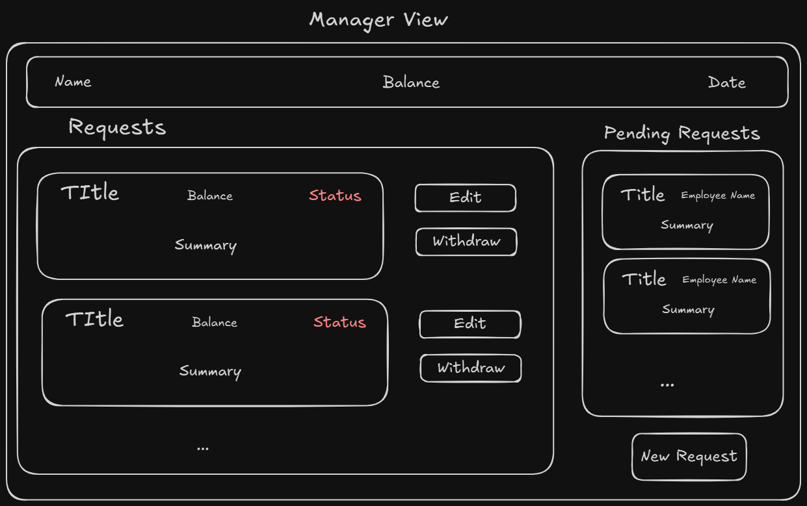
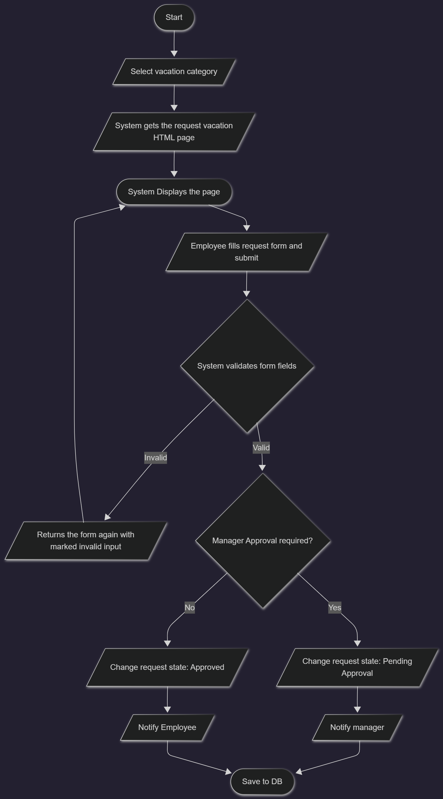
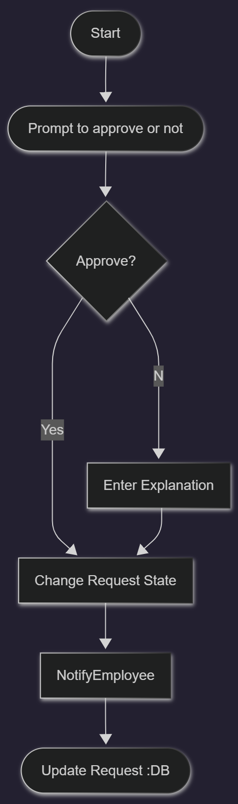
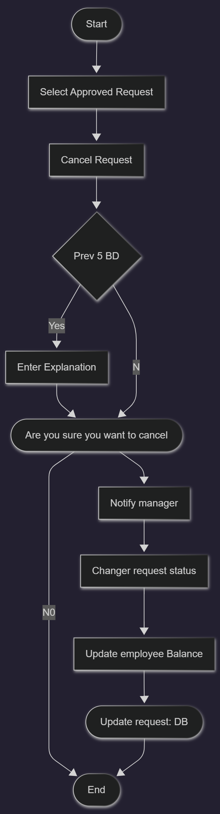
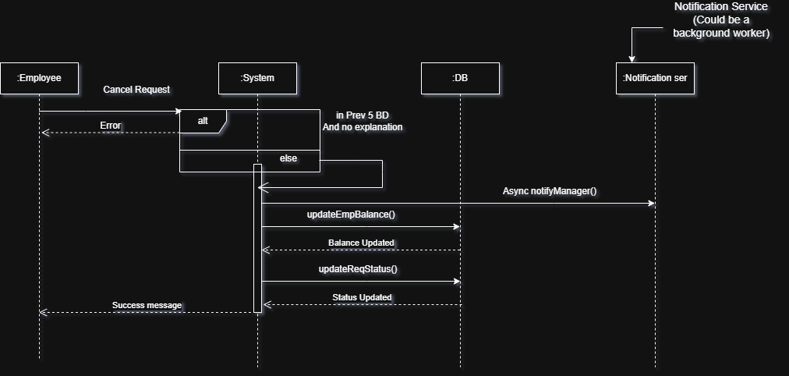
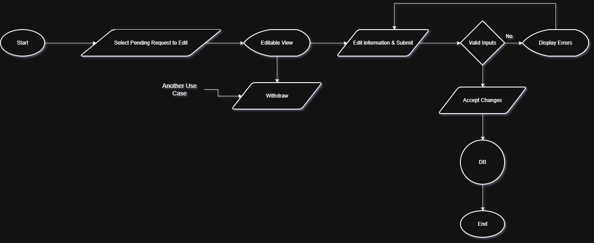
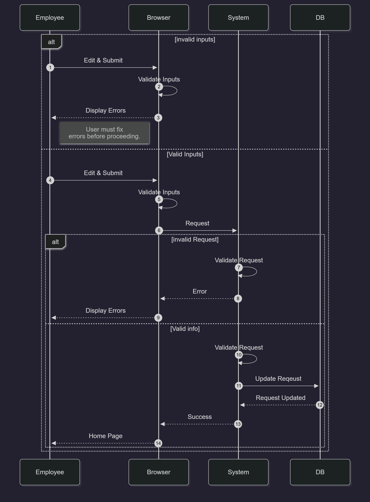
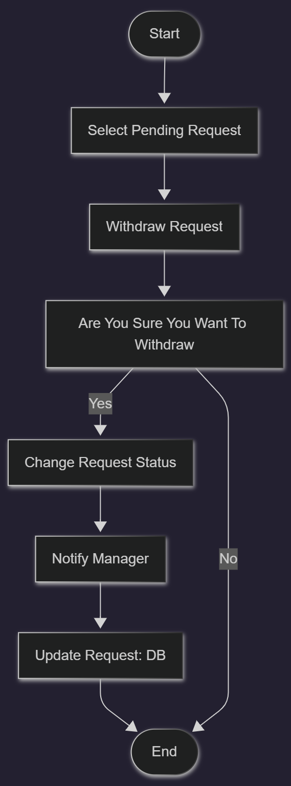

# Vacation Tracking System (VTS) – Analysis & Design

This repository contains the analysis and design artifacts for the **Vacation Tracking System (VTS)**, based on Chapter 12 of the _Object-Oriented Analysis & Design_ (3rd Edition). The system enables employees to submit vacation requests, managers to review and approve, and to mange employees information in the system and System Admin for the system's infrastructure.

## Motivation

The exercise is a mentorship task that aims to prepare us with Interpersonal & Technical skills required for the market.

## What’s Included

- Vision document
- Functional & Non-Functional Requirements.
- Actors, Constraints, Business Requirements, Assumptions.
- Relational Schema (tables).
- UML diagrams: Use Case diagram, Sequence diagram.
- Flowcharts representing key system flows from high level perspective.
- Pseudocode for major system operations.

## Tools Used

- Draw.io for diagrams and charts
- Microsoft Word for documentation.

## How to Browse

All diagrams with it's preconditions are in the [VTS-Analysis](VTS-Analysis.pdf).

---

<h2 align=center>High Level UI View</h2>

---

<h2 align=center>Data Model</h2>

## Employee View

## Manager View

---

<h2 align=center>(Manage Time Use Case) Diagrams & Flowcharts</h2>

### Use Case

### Flowchart (Employee Scenario)

### Flowchart (Manger Scenario - Approve / Reject)

### Sequence Diagram

---

<h2 align=center>(Cancel Approved Request) Diagrams & Flowcharts</h2>

## Flowchart

## Sequence Diagram

---

<h2 align=center>(Edit Pending Request Use Case) Diagrams & Flowcharts</h2>

## Flowchart

## Sequence Diagram

---

<h2 align=center>(Withdraw Request Use Case) Diagrams & Flowcharts</h2>

## Flowchart

## Sequence Diagram

---

Thank you for your interest.
Feel free to review, provide feedback, or fork for your own implementation!
