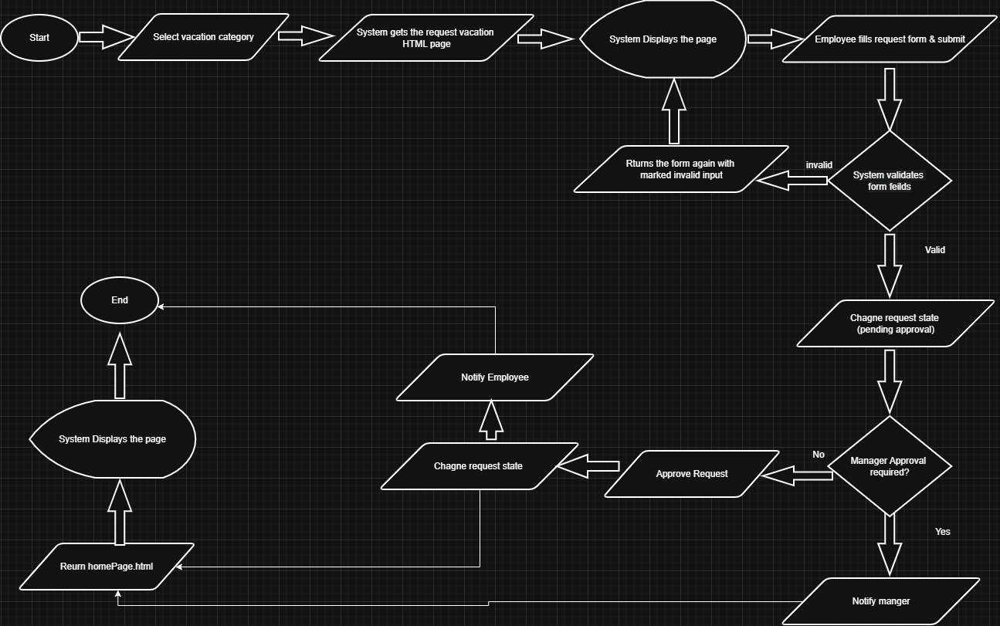
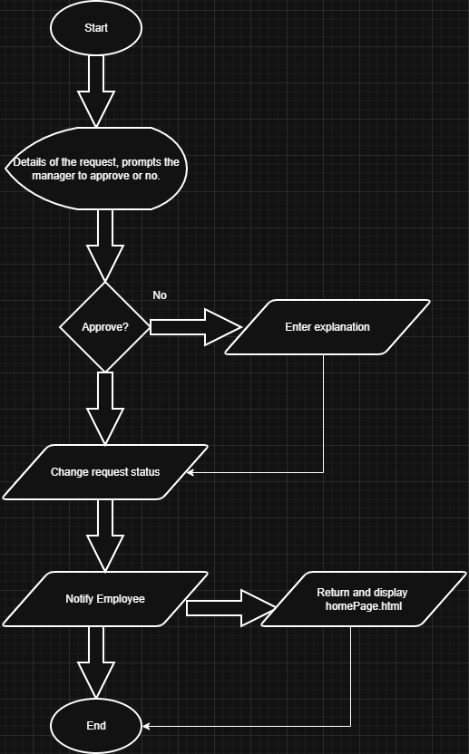

# Vacation Tracking System (VTS) – Analysis & Design

This repository contains the analysis and design artifacts for the **Vacation Tracking System (VTS)**, based on Chapter 12 of the _Object-Oriented Analysis & Design_ (3rd Edition). The system enables employees to submit vacation requests, managers to review and approve, and to mange employees information in the system and System Admin for the system's infrastructure.

## Motivation

The exercise is a mentorship task that aims to prepare us with Interpersonal & Technical skills required for the market.

## What’s Included

- Vision document
- Functional & Non-Functional Requirements.
- Actors, Constraints, Business Requirements, Assumptions.
- Relational Schema (tables).
- UML diagrams: Use Case diagram, Sequence diagram.
- Flowcharts representing key system flows from high level perspective.
- Pseudocode for major system operations.

## Tools Used

- Draw.io for diagrams and charts
- Microsoft Word for documentation.

## How to Browse

Every thing is in the `VTS-Analysis.pdf` and i also included a `.png` .

---

<h2 align=center>Manage Time Use Case Diagrams</h2>

### Use Case Diagram

### Create New Request Flowchart (Employee Scenario)

### Manage Request Flowchart (Manger Scenario - Approve / Reject)

### Sequence Diagram

---

Thank you for your interest.
Feel free to review, provide feedback, or fork for your own implementation!
